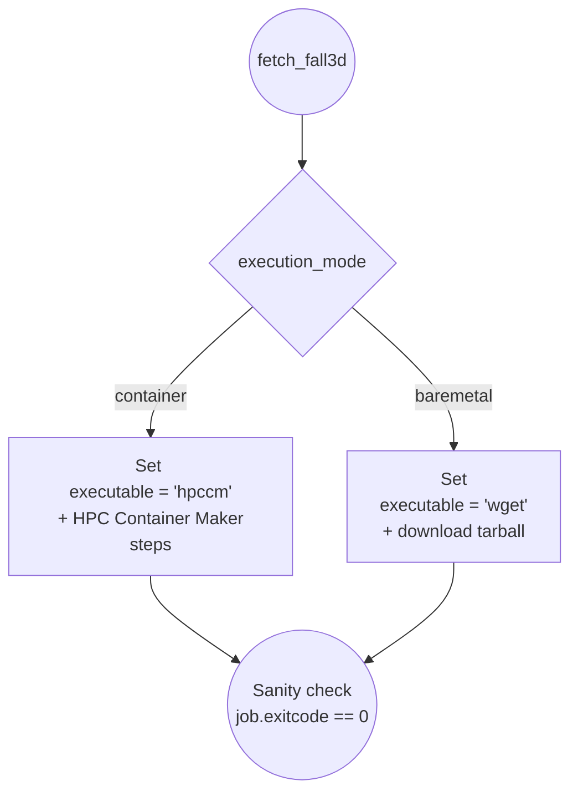

```shell
venv 
pip install requirements.txt
```


## Diagram Representation 




```shell 
reframe \
    -C power-capping/configuration/leonardo.py \
    -c power-capping/applications/fall3d/fall3d_deps.py \
    --prefix $PWD/REFRAME-TEST \
    -S execution_mode=baremetal \
    -lC 
```

```shell
reframe \
    -C power-capping/configuration/leonardo.py \
    -c power-capping/applications/fall3d/fall3d_deps.py \
    --prefix $PWD/REFRAME-TEST \
    --system=leonardo:login \
    -S execution_mode=baremetal \
    -S valid_prog_environs=gnu \
    -lC
```